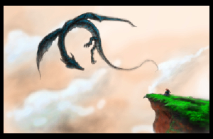
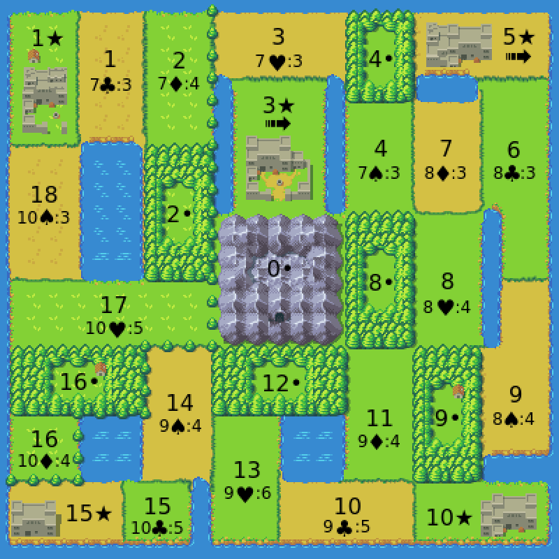
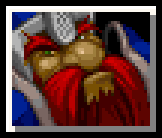
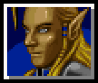
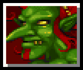
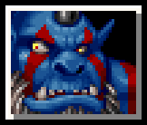
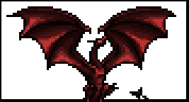
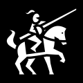

Dragon Dune
===========

A game for 4 players inspired by Avalon-Hill's Dune board game.

This was formally called Dragons, Usurpers, and Empires (DU&E), 
but the Internet hates ampersands.

So, let’s justify this thing's existence. Dune is a great game, but it
has its drawbacks. It's been out of print for 30+ years. The rules are 
kind of ambiguous. It can take a while to play. It can be tough to 
get 6 players together. Rex attempted to iron out some of these 
idiosyncrasies, but they removed things like binding agreements, which 
seem fundamentally important to a political wheeling-and-dealing game 
like Dune.

About This Game
---------------

This is an open-source, resource light game in the style of Avalon-Hill's
Dune board game, that is friendlier to beginners, faster, easier 
logistically (4 players instead of 6), with greater rule clarity, and a 
strong sense of theme.

Four factions fight to control the of the land of the Red Dragon: 

-   The Dwarves, who sell their treasury of artifacts to the highest 
    bidder to fund their armies. 
-   The Elves, cunning and mysterious, who possess arcane magic that 
    reveals future events.
-   The Goblins, who's bloodthirsty mercenaries fight for gold, even 
    against their own king. Their thirst for treasure finds them with a 
    trove of artifacts.
-   The Orcs, who control the lands of the west. They worship the 
    mighty Red Dragon.

Players take turns, buying artifacts to use in battle, recruiting 
forces and moving armies to collect gold and capture castles. All
while a horde of wild dragons move through the land, decimating 
everything that comes before them.

Battle plans are made in secret and simultaneously revealed. Magic
artifacts are used to support your armies. Even the winner of a 
battle can suffer terrible attrition.

Deals made publicly between players are magically bound, and must
be honored, if possible. This, along with the tremendous cost of
battle, adds a strong political component to the game.

Players may ally and share their advantages, but there can still be 
only one winner. The first player to end a turn controlling 3 or 
more castles has won the game. If there is no winner after 8 turns, 
then the Red Dragon still rules the land, and it's patron, the Orcs, 
win the game.

Details & Links
---------------

The game is the **6th Revision** (version 1.10).

This game is licensed Creative Commons Share-Alike 4.0,
by Vincent von Guard.

Contact: <dragon.dune.game@gmail.com>

Github: <https://github.com/dragon-dune/dragon-dune>

Web: <http://dragondune.inkfox.org>

PDF: <http://pdf.dragondune.inkfox.org>

Booklet: <http://booklet.dragondune.inkfox.org>

What You Need to Play:
----------------------

1.  The Board
2.  Faction Unit Markers (4 factions, 10 per faction)
3.  Hidden Unit Markers (10 total)
4.  Gold Markers (approximately 60 total)
5.  Deck of Standard Playing Cards
6.  One Troll Marker
7.  One Dragon Marker
8.  One First Player Marker

- - - - - - - - - - - - - - - - - - - - - - - - - - - - - - - 

Board:
======

Rules of Note:
--------------

1.  Territory 0• (in the middle of the board) is the Great Mountain 
    and is neutral territory. Players will never battle in territory 0•.
2.  Forest territories are represented by • (such as 16•). Units in a 
    forest territory are safe from dragon attack.
3.  Castle territories are represented by ★ (such as 10★). Players need 
    to control 3 castles to win the game. Units in a castle are safe from 
    dragon attack.
4.  A player controls a castle if they alone have at least one unit there.
    Hidden units have no effect on castle control.
5.  Players in control of 3★ or 5★ have access to griffins and receive a
    travel bonus. They may move through four territories in the movement
    round (instead of 2).
6.  Players may never have more than 10 units between on the board and
    the player's graveyard at any one time.
7.  No more than two players may have units in a castle at one time.
    Note that hidden units and the troll token do not count as units
    for the purpose of this limit.
8.  Public agreements made in the game are binding and must be carried
    out, if possible. Public agreements can only be broken if all parties 
    involved terminate the agreement.
9.  Players may form alliances, but there can still be only one winning
    player. Forming an alliance grants your ally an alliance power.
    Alliances can only be formed or broken during a Great Council after
    a Red Dragon. (This is a change from Dune, which allows to players 
    to share a victory.)
10. Players get one movement and one recruitment per round, unless another
    special effect allows it.
11. All players placing units in the same territory as the Troll Marker (3★)
    lose 4 units in that territory at the end of the Movement Round.
    If there are still units in the territory after the units are removed,
    then the Troll Marker is also removed.
12. Players may exchange gold at any time and for any reason, although players 
    may never exchange artifacts.
13. Units taking part in a battle are worth two battle points per unit.
14. The game lasts for 8 turns.

- - - - - - - - - - - - - - - - - - - - - - - - - - - - - - - 

Factions:
=========

Dwarves (♦):
---------------------------

The Dwarves empire has fallen. The are forced to sell artifacts from
their treasuries with the hope of one day reclaiming their birthright.

Start With: 5 Gold, 1 Artifact.

Starting Units: None.

Special:

1.  The Dwarves collect all gold spent by other players on on
    artifact cards. Gold spent by the Dwarves on artifact cards goes to
    the bank.
2.  The Dwarves may use their Jack as a Usurper (Queen) and their Queen 
    as a Sabotaged Artifact (Jack). So, if they had the Queen of Spades 
    and the Jack of Hearts, they could also play as though they had the 
    Queen of Hearts and the Jack of Spades.
3.  In battle, the Dwarves add a bonus of 2 battle point to their total,
    unless they are fighting the Orcs.
4.  Special Card (Ace): In the Recruitment and Movement round, the Dwarves
    may discard a Special Card to remove 2 units from their graveyard.
5.  Alliance Power: Your ally receives one free artifact card per turn; 
    your ally receives 1 gold from the bank every turn during the 
    collection round.

Elves (♥):
-----------------------

The ancient Elves have vast arcane knowledge, but they will need to be
clever to turn knowledge into gain.

Start With: 5 Gold, 1 Artifact.

Starting Units: 5 units in 5★.

Special:

1.  The Elves may see the artifact that is up for bid before
    bidding begins.
2.  In battle with the Elves (or their ally), the Elves may ask the
    color of their opponent's artifact card or to ask how many units 
    their opponent sending in to battle before selecting their own card 
    and units.
3.  At the beginning of the Recruitment and Movement Round, the Elves
    may see what the next event card will be.
4.  Elven units may go into hiding in a territory in order to escape 
    conflict. Hidden units act in every way as though they did not exist. 
    So, for example, they may not engage in combat, collect gold, be 
    attacked by the Troll, or control a castle. Hidden units may only 
    come out of hiding at the beginning of the Recruitment and Movement 
    round or by moving into a territory where their units are not hiding.
5.  Special Card (Ace): Elves may ask both the color of their opponent's 
    artifact card and ask how many units their opponent sending in to 
    battle before selecting their own card and units.
6.  Alliance Power: Your ally may ask question before a battle just as
    the elves do.

Goblins (♣):
------------------------

The Goblins are ruthless mercenaries who fight for coin, even against
their own king. Their thirst for treasure finds them with a trove of
artifacts.

Start With: 3 Gold, 2 artifacts.

Starting Units: 3 units in 10★.

Special:

1.  Goblins collect all gold spent on hiring Goblin mercenaries. Gold
    spent by the Goblins on mercenaries goes to the bank.
2.  The Goblins (and their ally) pay half price (rounded down) for
    Goblin mercenaries.
3.  When the Goblins win an artifact cards, they get a second artifact
    card that is hidden from the Elves.
4.  The Goblins may have up to 8 artifact cards (instead of 4).
5.  The Goblins (and their ally) may disband units at the beginning of 
    the movement round (instead of at the end).
6.  The Goblins (and their ally) may disband units for free (instead of
    one gold per unit).
7.  Special Card (Ace): You may discard a special card to stop a player 
    from hiring Goblin mercenaries that turn.
8.  Alliance Power: Your ally may may half price (rounded down) for Goblin 
    mercenaries (even the Orcs may do this); you may disband units at 
    the beginning of the movement round; you may disband units for free.

Orcs (♠):
----------------------

The Orcs control the territories of the west. They worship the
mighty Red Dragon.

Start With: 3 Gold, 1 artifact.

Starting Units: 5 units split between 1★, 9• & 16•.

Special:

1.  Orcs may not hire mercenaries. Instead, they my raise armies in
    Orcish territories (16, 16• , 17, 18, 1, 1★, 2, & 2•) at no cost.
2.  The Orcs may move units 3 territories in the movement round
    (instead of 2).
3.  The Orcs take only half losses (rounded up) against Dragons.
4.  The Orcs take no losses from the Red Dragon, which they worship.
5.  The Orcs may ride the Red Dragon when it appears, if they are in the
    same location.
6.  The Orcs may remove all 3 units from the graveyard at no cost 
    (instead of only receiving 1 free removal).
8.  In battle, the Orcs add a bonus of 1 battle point to their total.
9.  If no player has won at the end of the game, then Orcs are the
    default winner.
10. Special Card (Ace): In the Dragon Round, you may move some or 
    all of your units in any one territory to any other location.
11. Alliance Power: Your ally may remove 2 units from the 
    graveyard at no cost (instead of 1 free removal); your ally 
    takes no losses from the Red Dragon.

* * *

Cards:
======

1.  Player Cards

    -   Dwarven Graveyard (King of Diamonds)
    -   Elven Graveyard (King of Hearts)
    -   Goblins Graveyard (King of Clubs)
    -   Orc Graveyard (King of Spades)
    -   Dwarven Usurper (Queen of Diamonds)
    -   Elven Usurper (Queen of Hearts)
    -   Goblin Usurper (Queen of Clubs)
    -   Orc Usurper (Queen of Spades)
    -   Sabotaged Clubs Artifact (Jack of Clubs)
    -   Sabotaged Diamond Artifact (Jack of Diamonds)
    -   Sabotaged Heart Artifact (Jack of Hearts)
    -   Sabotaged Spade Artifact (Jack of Spades)

2.  Artifact Deck

    -   Special Card (Aces, All Suits)
    -   Artifacts (2 to 6, All Suits)
        -   Fire Artifacts (Hearts and Diamonds)
        -   Ice Artifacts (Spades and Clubs)

3.  Event Deck

    -   Event Cards (7 to 10, All Suits)

Special Card Actions:
---------------------

Aces are considered Special Cards.

Players may discard a Special Cards to:

1.  Not pay for an artifact card in the bidding round.
2.  Pay half of regular price (rounded down) for mercenaries in the Bidding and 
    Recruitment round.
3.  Move through one additional territory with your moved units in
    in the Bidding and Recruitment round.
4.  Make your units in one territory hidden for one turn. This must
    be done as soon as the units share a territory with another player's
    units. The units come out of hiding at the the beginning of next 
    turn's Recruitment and Movement round (at the same time that the
    elves choose to stay hidden or not).
5.  May be played as an artifact in battle with a value of 1.

Special Cards may also be discarded to negate certain special abilities:

1.  May be played to stop the Elves (or ally) from asking a battle question.
2.  May be played to stop the Orcs from surviving a Red Dragon encounter.
3.  May be played to stop the Goblins  (or ally) from disbanding units at the 
    beginning of the Movement and Recruitment round (they may still disband at 
    the end of the round).
4.  May be used to stop the Dwarves from using their Queen card as a Sabotaged
    Artifact and their Jack card as a Usurper.

Note: Special Cards cannot negate another special card action. So, for example, 
you could stop the elves from asking a battle question (per their normal power), 
but you could not stop them from using a Special Card to ask two battle questions.

* * *

How To Play:
============

Rounds:
=======

Setup:
------

1.  The board is set up. Players place their starting units.
2.  If there are any Oracles, they make their victory predictions.
3.  One player is picked at random to be the Stating Player.
4.  The Dragon Marker is placed. Roll the die and multiply the number
    by three, then roll the die again and add that amount. This is the 
    starting location of the Dragon Marker.
5.  Place the Troll Marker on 3★.
6.  If any other factions are not being played, place a Troll Marker
    in place of their starting units.
7.  Each player is given the King of their faction from the deck.
    They place this card face up in front of them. This is their
    graveyard. This is the only card that has to be shown. All other
    cards may be kept secret until used.
8.  Each player is dealt one of the Queens face down. Players may look
    at them.
9.  Each player is dealt one of the Jacks face down. Players may look
    at them.
10. Each player is dealt one artifact card face down. Players may look
    at them.
11. The Goblins are given a second artifact card face down, which they
    may look at.

I. Dragon Round:
----------------

1.  The top card of the Artifact Deck is revealed. The Dragon Marker is 
    moved that amount from its starting position through the board, in
    numerical order. The dragon goes through all territories with the 
    same numerical value, so the dragon would go to both 1★ and 1 when 
    the dragon was at 1. The revealed card is then placed in the Artifact
    discard pile.

    -   Note that the dragon marker never moves to territory 0•

2.  Any units or gold the dragon marker encounters as it moves 
    through the board that are not in a castle or forest are 
    removed form the game. 

    -   Note that Orcs only take half losses, rounded up.

3.  When the dragon marker reaches  territory 18, it will next move 
    to the 1★ and 1.
4.  In the Recruitment and Movement round, players may never recruit 
    units at or move units through or to a territory with the dragon 
    marker.

II. Event Round:
----------------

1.  A first card is revealed from the Event Deck and set aside. Then a 
    second card is revealed from the Event Deck. If the second card 
    revealed is the same suit as the card on the top of the discard pile, 
    then the the Red Dragon appears at the at location of the card at the 
    top of the discard pile.

2.  If the Red Dragon appears, then:

    -   The Red Dragon has attacked the territory at the top of the event 
        discard pile (the territory where the previous event took place). 
        All units and gold in that territory are lost.
    -   If the Orcs are in the same territory as the Red Dragon, they 
        may move some or all of their units at that location to any
        other location.
    -   In response to the appearance of the Red Dragon, a Great Council 
        is called immediately. This is the only time players may form or
        break alliances. The Great Council continues until all players 
        have passed or formed an alliance.
    -   The dragon marker does NOT go to the Red Dragons location. The
        dragon marker is only moved on the Dragon Round.

3.  Two gold are placed on the location corresponding to the second revealed 
    card, unless the dragon marker is at that location. The second card
    revealed is then placed on the Event Discard pile.

4.  The amount of gold indicated on the board is placed on the location
    corresponding to the first card revealed, unless the dragon marker is 
    at that location. The first card revealed is then placed on the Event
    Discard pile.

III. Bidding Round:
-------------------

The Starting Player is the first Starting Bidder.

One card is placed up for bid for each player that does not have their
maximum number of cards. For each card up for bid, one at a time.

1.  The Elves, and only the Elves, are shown the card.
2.  Players, starting with the Starting Bidder, bid on card. Note that 
    players may continue to bid even if previously they had passed on 
    the card.
3.  The winner receives the card and pays the Dwarves.

    -   If the Dwarves win the artifact, their payment is payed to the bank.
    -   If the Goblins win the artifact, they receive a second artifact
        that is not revealed to the Elves.
    -   The winner may play a Special Card to avoid paying.
    -   The ally of the Dwarves my elect (on one card per turn) not to pay.

4.  The whole process repeats for the next player in player order.
    For each card, the next player after the current Starting Bidder 
    (in player order) becomes the next Starting Bidder.
5.  At the end of the Bidding Round, the Elves are shown the next event 
    card.

IV. Recruitment and Movement Rounds:
------------------------------------

The Elves must declare if any of their units are coming out of hiding.
All non-elven hidden units come out of hiding.

Notes on Hidden Units:

-   The Elves (or a player with a Special Card) must declare if their
    units go into hiding as soon as they share the territory with another
    player's units or with the Troll. They may not decide to go into 
    hiding after the fact.
-   If a player conscripts, moves, or recruits units into a territory where 
    they already have units, then they must have the same status (hidden 
    or unhidden) as the units that were already in the territory. If hidden 
    units are moved into an empty territory then they may elect to come
    out of hiding.

Then, starting with the Starting Player, and the proceeding in player 
order, all players may (in the following order):

1.  The current player may remove up to 3 units from the players graveyard.
    The first unit removed is free. The second and third units removed 
    costs 1 gold each.
    
    -   The ally of the Orcs may remove a the second unit from their 
        graveyard at no cost.
    -   The Orcs may remove all 3 units from their graveyard at no cost.

2.  If the current player is the Goblins (or their ally) they may disband 
    some or all of the units in one territory at no cost. Disbanded units 
    are removed from the board, but do not go to the graveyard. 
    
    -   Note that disbanding units at the beginning of the turn frees 
        up units to be recruited at another location in that same turn.
    
3.  The current player may conscript 1 units from the bank onto
    any territory where they already have a unit. This action is free.
4.  The current player may hire Goblin mercenaries at a cost of 1 gold
    per mercenary if it is in a city, or 2 gold per mercenary if it is
    into any other territory. The payment is made directly to the Goblins.

    -   Goblin mercenaries may not be hired in any territory where the
        dragon marker is present.
    -   Payments made by the Goblins (and their ally) are half price
        (rounded down).
    -   The Goblin's payment is made to the bank.
    -   The Orcs may not hire mercenaries. Instead, they my raise armies 
        in Orcish territories (16, 16•, 17, 18, 1, 1★, 2, & 2•) at no cost.
    -   If the Orcs are allied with the Goblins then they may hire goblin
        mercenaries to any valid location at the usual rate, or may raise 
        armies in the Orcish territories, but they may not do both.
    -   The player may play a Special Card to pay half the standard price 
        (rounded down).

5.  The current player may move some or all units from one location
    through two territories.

    -   Units may not move through or to any location where the dragon 
        marker is present.
    -   The Orcs may move through three territories.
    -   If the player has access to griffins (if they control of 3★ 
        or 5★) then they may move through four territories.
    -   The player may play a Special Card to extend their movement 
        range by 1 territory.

6.  The current player may disband some, or all, of the units in one 
    territory at the cost of one gold per token. Disbanded units are 
    removed from the board, but do not go to the graveyard.
7.  The whole process repeats for the next player in player order.

After all players have taken their turns, then each player with units 
in the same territory as the Troll Marker has 4 units removed from that 
territory. If there are still units then the Troll Marker is also removed.

V. Battle Round:
----------------

Starting with the Starting Player, and the proceeding in player order, if 
a player has units in the same territory another player, they shall do 
the following (in the following order):

1.  The player whose turn it is is the attacking player.
2.  If the Elves (or their ally) are taking part in the battle, they may 
    ask what color artifact their opponent will play, or ask the size of 
    the army they will send into battle. The answers to these questions are 
    binding.
3.  Each player secretly records how many units they will send as an
    army into battle, and they may select one artifact to use in
    the battle. For each unit sent into battle the army receives two
    points of battle value.
4.  Players reveal the size of their armies and their artifacts selected.
    Note that players may choose not to select an Artifact to use in battle.
5.  For each color (red and black), whomever played the lower numbered
    artifact of that color, gets that amount added to their battle value.
    If two artifacts of the same color are played, the higher valued 
    artifact is discarded, regardless of who wins the battle.

    -   If the two artifacts played are the same number and color, then 
        both artifacts are destroyed.
        
6.  The player with the highest battle value wins the battle. In the case
    of a tie, the attacker wins.
7.  The winner removes all units used in an army in the battle.
8.  The loser removes all units from the territory, regardless of whether
    or not they took part in the battle. The loser also discards all
    artifact cards used.
9. If a player who took part in the battle has a their opponent as
    their usurper, and has a sabotaged artifact of the same suit as the
    artifact their opponent played, then they may declare their
    treachery and automatically win the battle, taking no losses. The
    loser removes all units from the territory (even those not used in
    the battle), and discards any artifacts used in the battle. The winner 
    also receives two gold.
10. This process continues until all battles for a player are resolved.
11. Then the whole process repeats for the next player in player order.

VI. Collection Round:
---------------------

1.  All players receive 1 gold.
2.  Players receive 1 gold for each castle they control.
3.  For any gold on the board, the player whom controls the territory 
    the gold is in may collect two gold from the board for every unit 
    in the territory, up to the amount of gold in the territory.
4.  If players wish, they may discard some or all of their artifacts.

VII. Victory Round:
-------------------

1.  The next player (in player order) after the current Starting Player
    becomes the Starting Player for the next turn.
2.  If any player controls three castles then they have won the game.
3.  If 8 turns have passed without a winner, then the Orcs win.

    -   If the Orcs are not playing, then whomever has the most castles
        wins. If there is a tie, then the tied players may fight with any 
        units already present in 0• (normally a neutral territory),
        with the winner of the battle winning the game. If there is still
        winner, then the first of the tied players in player order is the
        winner.
        
4.  If then game has not ended, then it goes back to the Dragon Round.

* * *

Optional Gameplay Mechanics:
===========================

Oracles
-------

Before the game, players may decide to have have one or more Oracles. 
If a player is an Oracle then they secretly record the faction that predict 
to win the game, the turn they will win the game, and one castle that they 
will control when they win. Neither an Oracle victory or an Orc 6th round 
default victory may be predicted.

If the Oracle is correct in their prediction, then they are the winner. If
two or more Oracles have predicted the win, then the player whose victory
they predicted is the winner.

Weaknesses
----------  

Orcs and Goblins are weak against Ice Artifacts, Elves and Dwarves are 
weak against Fire Artifacts. In any battle in which your opponent 
successfully plays an Artifact that you are weak against, you lose 2 
battle points from your total for that battle.

Optional Advanced Faction Powers:
=================================

What could be more Dune-like than having optional rules that no one can 
agree on. Here are additional faction powers that may add depth or help
balance the game.

-   Orcish Plunder: The Orcs may steal artifacts. When they win a battle, 
    they may take one of their opponents artifacts (randomly chosen), 
    which they may then keep or discard for a reward of 1 gold.
-   Dwarven Elite Warriors: The Dwarves are fierce warriors. Two of their
    ten units are special units, which act as normal units in every way 
    except that each unit counts as two units for the purpose of combat
    (worth 4 battle points each, instead of the 2 for regular units).
-   Elven Blessing: After the Elves have lost 3 units in combat, they are
    given the power to invoke a blessing for one battle once per turn that 
    gives them an bonus battle point and makes it so they can not be 
    sabotaged for that battle.
-   Goblin Initiative: The Goblins may take their turn in the Recruitment 
    and Movement round at any time, regardless of player order.

Optional Advanced Special Card Actions:
=======================================

Players may discard 2 Special Cards to:

1.  Make an extra movement during the Recruitment and Movement Round.
2.  Ask one yes or no question of another player that must be answered
    honestly.
3.  Cause a chaos monster to be summoned in a battle that player is taking 
    part in where an artifact with a value of 6 has been played by either 
    (or both) players. The chaos monster, somewhat predictably, destroys 
    all gold and units in the  territory, as well as all artifacts used in 
    the battle.
4.  To destroy the castle walls of one territory, causing that territory
    to no longer be safe from dragon attack on the Dragon Round. The player
    must have a unit within 1 territory of the territory to be affected.
5.  To control the dragons on the Dragon Round, causing them to be moved
    an amount selected by the player (between 1 and 6) instead of the 
    revealed Artifact card. 

Balancing Options:
==================

The Goblins may be too powerful, and if this is found to be the case, 
then all players should receive an additional conscription.

The Orcs may be too powerful, and if this is the case, the Orcs should 
only be allowed to revive 2 units for free, instead of 3.

The Dwarves may be too powerful, and if this is the case the Emperor should
receive 1 less gold for each artifact purchased (the 1 gold goes to the bank).

If the Elves are too powerful, then I don't know; maybe they start with 3 gold.

* * *

Special Thanks:
===============

I would like to thank the creators of Dune and Rex.

I would like to thank artists that make their work available to the open
source community.

-   Jinn’s Icons (by Jinn) 
    https://opengameart.org/content/jinns-icons
-   Wyvern and Girl (by 5hiroi)
    https://opengameart.org/content/wyvern-and-girl
-   Dragon head icon (by Lorc)
    http://game-icons.net/lorc/originals/dragon-head.html
-   Crossed swords icon (by Lorc)
    http://game-icons.net/lorc/originals/crossed-swords.html
-   Locked chest icon (by Lorc)
    http://game-icons.net/lorc/originals/locked-chest.html
-   Card pickup icon (by Quoting)
    http://game-icons.net/quoting/originals/card-pickup.html
-   Mounted knight icon (by Skoll)
    http://game-icons.net/skoll/originals/mounted-knight.html
-   Coins icon (by Delapouite)
    http://game-icons.net/delapouite/originals/coins.html
-   Poker Hand icon (by Lorc)
    http://game-icons.net/lorc/originals/poker-hand.html
-   Ace icon (by Lorc) 
    http://game-icons.net/lorc/originals/ace.html
-   Overworld Tiles (by Buch) 
    https://opengameart.org/content/overworld-tiles-0
-   Throne king icon (by Delapouite under CC BY 3.0)
    http://game-icons.net/delapouite/originals/throne-king.html
-   Battle axe icon (by Lorc under CC BY 3.0)
    http://game-icons.net/lorc/originals/battle-axe.html
-   Wood club icon (by Delapouite under CC BY 3.0)
    http://game-icons.net/delapouite/originals/wood-club.html
-   Bow arrow icon (by Delapouite under CC BY 3.0)
    http://game-icons.net/delapouite/originals/bow-arrow.html
-   Sacrificial dagger icon (by Lorc under CC BY 3.0)
    http://game-icons.net/lorc/originals/sacrificial-dagger.html
-   Diablo skull icon (by Lorc under CC BY 3.0)
    http://game-icons.net/lorc/originals/diablo-skull.html
-   Crown coin icon (by Lorc under CC BY 3.0)
    http://game-icons.net/lorc/originals/crown-coin.html

    
    
